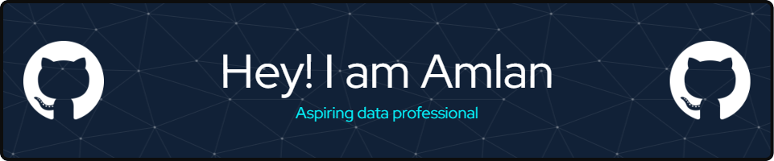

  

###

  

###

  

###

<h1 align="center">hey there 👋</h1>

###

<h3 align="left">👩‍💻  About Me</h3>

###

I'm Amlan.  🔭  I worked as a Data Science Working student and Intern at Heraeus Precious Metals.  📚 I'm currently learning about advanced machine learning and LLMs  ⚡  In my free time, I enjoy traveling, playing games, or watching series.  💡 Passionate about transforming data into actionable insights.  🌟 Always eager to connect and collaborate on exciting data projects!  Feel free to check out my repositories and projects, and don't hesitate to reach out for collaborations or networking opportunities!

###

<h3 align="left">🛠 Language and tools</h3>

###

  
  
  
  
  
  
  
  
  
  
  
  
  
  
  
  
  
  
  
  
  
  
  
  
  

###

<h3 align="left">🔥   My Stats :</h3>

###

  

###
